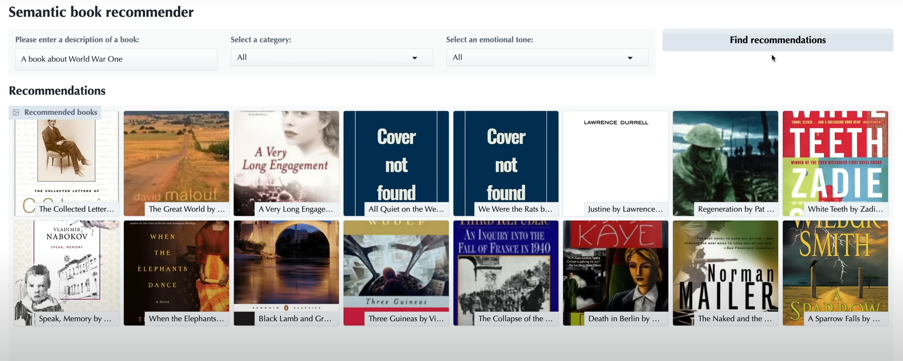
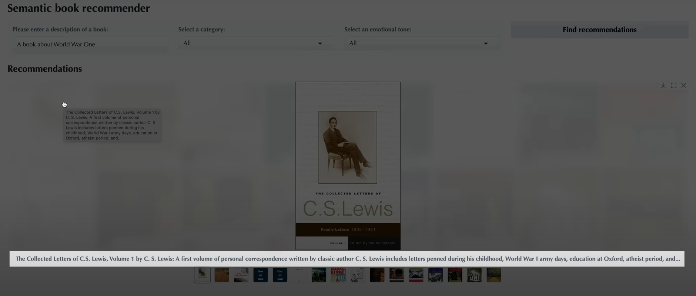
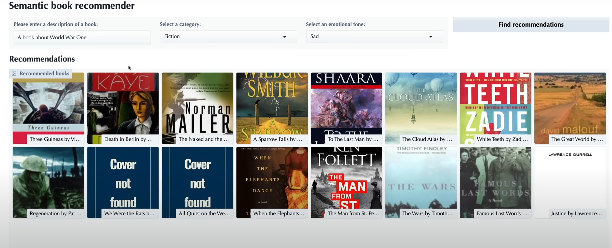

# Build a Semantic Book Recommender with LLMs – Projet personnel

Ce projet est une reproduction complète du tutoriel **freeCodeCamp** "Build a Semantic Book Recommender with LLMs – Full Course".  
Il consiste à créer un système de recommandation de livres basé sur le contenu sémantique des descriptions, en utilisant des modèles de langage (LLMs), la recherche vectorielle, la classification zero-shot et l’analyse des sentiments.

---

## 🚀 Fonctionnalités principales

1. **Nettoyage et exploration des données textuelles**  
   Analyse, nettoyage et préparation d’un dataset de livres téléchargé depuis Kaggle.  
   Visualisations des données avec `matplotlib` et `seaborn`.

2. **Recherche sémantique (vector search)**  
   Conversion des descriptions en vecteurs numériques via des embeddings OpenAI.  
   Construction d’une base de données vectorielle avec Chroma et LangChain pour retrouver les livres les plus proches d’une requête naturelle.

3. **Classification zero-shot avec LLMs**  
   Classification automatique des livres en catégories *fiction* ou *non-fiction* sans données annotées, grâce à un modèle pré-entraîné.

4. **Analyse des sentiments et extraction d’émotions**  
   Identification du ton émotionnel (joie, tristesse, suspense, etc.) dans les descriptions des livres.  
   Possibilité de filtrer les recommandations selon cette tonalité.

5. **Interface utilisateur interactive avec Gradio**  
   Dashboard web simple permettant à l’utilisateur de formuler une requête, choisir le type de livre et l’émotion souhaitée, puis d’obtenir une liste de recommandations.

---

## 🛠️ Environnement technique

- **Python 3.11**  
- Bibliothèques utilisées :  
  `kagglehub`, `pandas`, `matplotlib`, `seaborn`, `python-dotenv`,  
  `langchain-community`, `langchain-opencv`, `langchain-chroma`,  
  `transformers`, `gradio`, `notebook`, `ipywidgets`  
- Clé API OpenAI à placer dans un fichier `.env` à la racine du projet  
- Données téléchargées depuis Kaggle (instructions dans le repo officiel)

---

## 📚 Ce que ce projet m’a permis d’apprendre

- Maîtrise pratique des LLMs pour la recherche sémantique, la classification zero-shot et l’analyse de sentiments.  
- Construction et interrogation d’une base de données vectorielle avec LangChain et Chroma.  
- Nettoyage et exploration avancée de données textuelles volumineuses.  
- Création d’une interface utilisateur simple et efficace avec Gradio.  
- Structuration d’un projet modulaire en Python avec notebooks et scripts exécutables.

---

## 📂 Contenu du repo

- `data-exploration.ipynb` : nettoyage et analyse des données brutes  
- `vector-search.ipynb` : construction et interrogation de la base vectorielle  
- `text-classification.ipynb` : classification zero-shot des livres  
- `sentiment-analysis.ipynb` : analyse des sentiments des descriptions  
- `gradio-dashboard.py` : application web interactive pour la recommandation  

---

## 📸 Captures d'écran

### Vue d'ensemble de l'application

### Description d'un livre

### Filtrage par fiction et sentiment "Sad"

---

## 🔗 Liens utiles

- Dataset Kaggle : [instructions dans le repo officiel]  
- Documentation LangChain : https://python.langchain.com  
- Tutoriel freeCodeCamp original : https://www.freecodecamp.org/news/build-a-semantic-book-recommender-using-an-llm-and-python

---
*Projet réalisé dans le cadre d’une montée en compétences sur les technologies NLP et LLM.*
